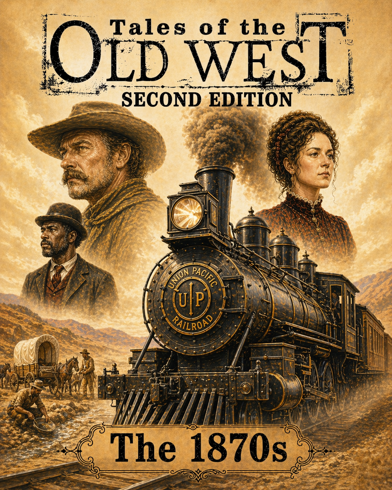

<!-- markdownlint-disable MD013 MD024 -->

# Tales of the Old West 2E

  
  

My big project is an unofficial, cleaned-up, restructured markdown manuscript
set for _Tales of the Old West_ — a gritty tabletop RPG set on the American
frontier of the 1870s.

This is not an official release. It is a fan-made manuscript set and companion
toolkit for groups who want to run, expand, and build on _Tales of the Old
West_ with serious intent.

## What is in this repository

- `01-corebook/` — the complete player-facing core book
- `02-the-1870s/` — the setting supplement for the wider 1870s West
- `skills/western-writing/` — the repo-local skill for prose voice, lore,
  and editorial passes
- `CHANGELOG.md` — the version-by-version development record
- `LICENSE.md` — the rights and notice file for this repository

## The two books

### Book 01 — _Tales of the Old West_

The corebook carries the game forward as a full working rules volume rather
than a loose stack of chapters. It gathers character creation, core rolls,
talents, conflict, damage, everyday survival, the historical frame, and the
campaign tools a table needs to start and keep going.

What this book brings:

- a complete introduction and welcome chapter
- character creation and player-facing guidance
- the core dice engine and resolution procedures
- talents and special abilities
- conflict, damage, injuries, and recovery
- life in the Old West, including work, gear, and settlement pressure
- the west in the 1870s as a usable historical frame
- campaign tools, GM-facing guidance, and starter support
- the New Mexico campaign chapter
- the Patience Is a Virtue adventure
- outlaws, pursuit, and the shape of frontier trouble

### Book 02 — _Supplement 1: The 1870s_

The 1870s supplement turns the broader American West into a usable setting
book. It is built for table play, not just reference reading, so each chapter
adds concrete ground, practical constraints, and the kind of detail that
changes decisions in play.

What this book brings:

- front matter and editorial framing for the setting
- peoples, conflict, and frontier social pressure
- Native cultures and borderlands context
- childhood, women, food, work, and material culture
- language, literacy, print, religion, and faith
- frontier survival, hunting, and the costs of travel
- availability, prices, towns, economy, law, and procedural detail
- cowboy life, horse culture, mining camps, and army life
- outlaw craft, gambling, music, entertainment, medicine, and death
- the dark frontier and regional landscapes
- a full example adventure: `The Yellowstone Line`
- appendix material for named NPCs and handouts

## What this project brings

- a cleaned and reorganized manuscript structure
- a two-book layout with clear directory boundaries
- a repository-local `western-writing` skill for voice and consistency
- a versioned changelog for editorial history
- a rights notice that keeps the project clearly unofficial
- a usable workbench for further western manuscript drafting

## AI and campaign work

The `skills/western-writing/` folder is the main copilot layer for this repo.
It exists so an AI agent or human editor can keep new material in the same
register without re-explaining the basics every time.

### Use it for

- western prose voice and manuscript tone
- lore and historical consistency checks
- editorial cleanup and formatting passes
- example scenes, vignettes, and atmospheric text
- new manuscript material that needs to match the existing book line

### Local use

If your agent supports repo-local skills, copy or symlink the folder into your
workspace skill path and keep the `SKILL.md` entry point intact.

## Back matter and support files

- `CHANGELOG.md` for the development record
- `LICENSE.md` for rights and attribution
- cover files and chapter assets that live alongside the manuscript
- editorial helpers and scripts used during cleanup

## License and notice

This repository is an unofficial project that references _Tales of the Old
West_, a tabletop roleplaying game created and published by Galloping Horse
Games.

This project is not affiliated with, sponsored by, or endorsed by Galloping
Horse Games.

Read `LICENSE.md` before publishing, distributing, or remixing material from
this repository.
