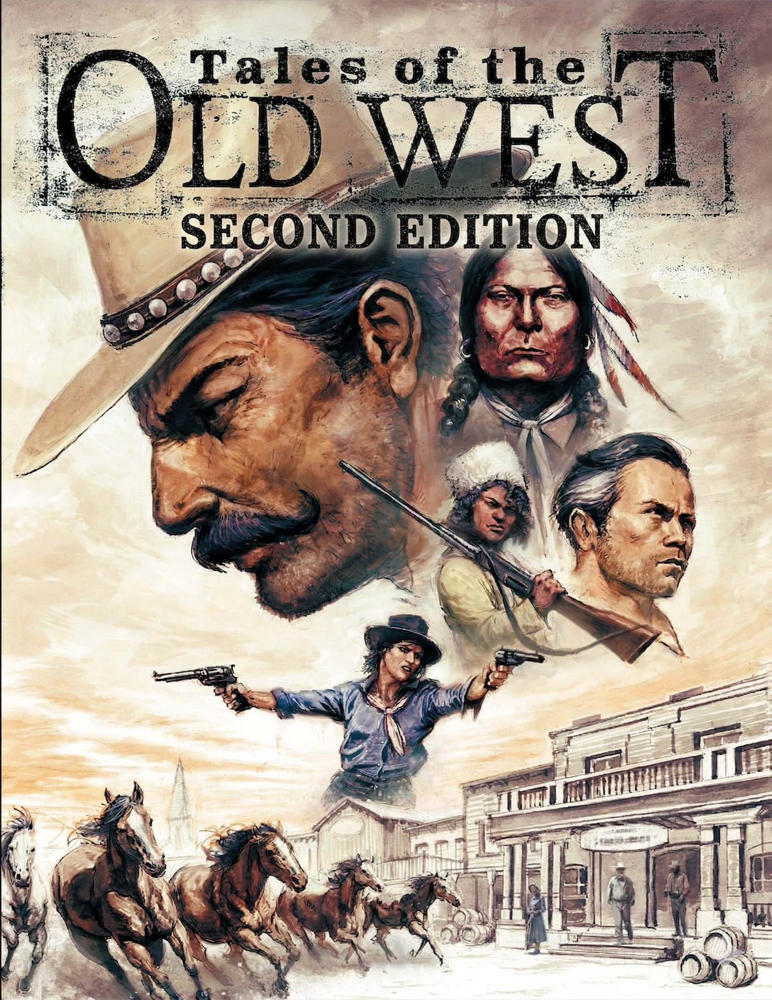

<!-- markdownlint-disable MD013 MD024 -->

# Tales of the Old West 2E

Public workbench for a cleaned-up, restructured markdown manuscript of
_Tales of the Old West_ — a gritty tabletop RPG set in the American frontier
of the 1870s.

  

## Overview

This repository contains:

- an integrated `corebook/` manuscript split by chapter
- a `skills/` folder with AI authoring skills adapted for western RPG writing

The manuscript was converted from PDF, cleaned with automated tooling, and
formatted to match professional RPG corebook standards. It remains a working
draft and should be treated as editorial material rather than a finished
publication.

## Repository Layout

- `corebook/`
  - The integrated manuscript, one file per chapter.
  - **Contents**:
    - `01-welcome-to-the-old-west.md` — Introduction and overview
    - `02-your-player-character.md` — Character creation
    - `03-rolling-the-bones.md` — Core dice mechanics
    - `04-talents.md` — Talents and special abilities
    - `05-conflict-and-damage.md` — Combat, brawling, and social conflict
    - `06-life-in-the-old-west.md` — Daily life, work, property, and settlement
    - `07-the-west-in-the-1870s.md` — Historical setting and context
    - `08-campaigns-in-the-old-west.md` — GM tools and campaign frameworks
    - `09-the-new-mexico-campaign.md` — The New Mexico starter campaign
    - `10-patience-is-a-virtue.md` — Patience is a Virtue adventure module
- `skills/`
  - AI authoring and analysis skills for working with the manuscript.
  - `western-writing/` — Prose voice, diction, and anti-AI rules for western RPG text
  - `western-rpg-design/` — Mechanics analysis and design methodology
  - `rpg-balance-analysis/` — Four-lens balance evaluation framework
  - `rpg-synergy-analysis/` — Multi-rule interaction auditing
  - `pdf-to-rpg-markdown/` — PDF-to-markdown extraction and cleanup pipeline
- `scripts/`
  - Utility scripts used during manuscript preparation.
- `CHANGELOG.md`
  - Version history.
- `LICENSE.md`
  - Rights and attribution notice.

## Source Material

_Tales of the Old West_ is a tabletop RPG by Galloping Horse Games. This
repository contains a markdown conversion of the core rules PDF, cleaned and
restructured for reference use. The original game and its content belong to
the original creators.

## Generative AI Disclosure

This repository includes AI-assisted PDF-to-markdown conversion, cleanup
scripting, and editorial tooling. The game text itself is from the original
published PDF.

## Editorial Principle

The goal is a clean, readable, properly structured markdown manuscript — not
a rewrite. The text preserves the original author's voice, rules, and
structure while fixing extraction artifacts from the PDF conversion process.
