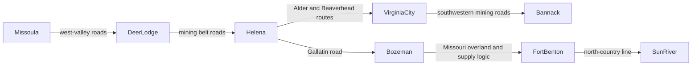
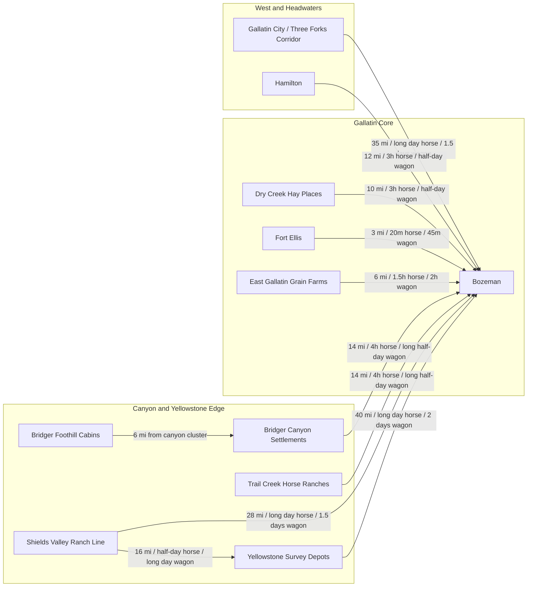

# Montana Settlement Distance and Mermaid Mapping Guide

This document defines how to map settlement distance, travel time, and visual settlement position for the Montana supplement.

The goal is not a modern GIS-perfect atlas. The goal is a historically grounded campaign map that helps the reader understand:

- where settlements sit relative to one another
- which places are practical neighbors
- how long travel takes by horse and wagon
- how weather, rivers, military danger, and roads change the meaning of distance

## Primary Historical Map Anchors

Use these sources first when positioning settlements and checking relative geography.

1. W. W. DeLacy, `Map Of The Territory Of Montana`, `1872`
   Source: David Rumsey Historical Map Collection
   Link: https://www.davidrumsey.com/maps1724.html
   Use for: territorial-scale placement, river systems, mountain structure, route logic, named settlements in the early `1870s`.

2. `Montana Territory`, `1879`
   Source: Library of Congress Geography and Map Division
   Link: https://www.loc.gov/resource/g4250.cws00190/
   Use for: county lines, military reservations, later territorial settlement spread, cross-checking the wider network.

3. Montana Historical Society map collection
   Link: https://mhs.mt.gov/research/collections/map
   Use for: additional historical maps, township plats, topographic reference, and confirmation of local route structure.

## Secondary Historical Anchors

Use narrative and local-history material to confirm real route relationships and remembered distances.

- Yellowstone historical travel account noting:
  - Hamilton to Bozeman at about `18` miles
  - Fort Ellis at about `2.5` miles from Bozeman
  - Gallatin City reached on the next major westward stage of travel
  Source lead: Montana State University Library PDF
  Link: https://www.lib.montana.edu/digital/objects/coll2570/2570-B01-F03.pdf

- Fort Ellis as a real military post east of Bozeman watching the Gallatin Valley and nearby passes
  Source lead: National Park Service historical material
  Link: https://www.nps.gov/parkhistory/online_books/soldier/sitec8.htm

- Gallatin City / Three Forks local historical placement and movement around the headwaters region
  Source lead: Headwaters Heritage Museum and local Three Forks history
  Links:
  - https://www.headwatersheritagemuseum.org/gallatin-city
  - https://www.threeforksmontana.us/our-history

## Distance Mapping Rules

When building a Montana settlement map, do not treat all miles as equal.

Use this priority order:

1. Exact historical route distance if a period source gives it.
2. Mapped wagon-road or valley-route estimate from the historical map.
3. Terrain-adjusted estimate from river corridor, pass, canyon, or basin placement.
4. Straight-line distance only as a last resort, and never present it as a real travel route.

Always prefer route distance over direct-line distance.

## Travel Time Assumptions

Use these default assumptions unless a chapter gives stronger local evidence.

| Travel mode | Easy valley road | Rough road / broken country | Mountain, canyon, or military frontier track |
| --- | --- | --- | --- |
| Horseback | `3 to 4` miles per hour sustained | `2.5 to 3` miles per hour | `1.5 to 2.5` miles per hour |
| Wagon | `2 to 2.5` miles per hour | `1.5 to 2` miles per hour | often impractical or `1 to 1.5` miles per hour |

Translate those into readable campaign language:

- under `5` miles: less than `2` hours on horseback
- `10 to 15` miles: about half a day on horseback
- `20 to 30` miles: long day on horseback or roughly `1` day by wagon
- `35 to 50` miles: very long day on horseback or `1.5 to 2` days by wagon

## Seasonal Adjustment Rules

Every distance note should be followed by a short seasonal caution when the route is exposed.

Use these standard warnings:

- `Spring thaw`: wagon times can double on bad roads.
- `High water`: ferries, fords, and riverbank approaches become the main constraint.
- `Winter snow`: canyon roads and pass routes may function like twice the mapped distance.
- `Military danger`: a route can be physically open and still unsafe for ordinary travel.

## Required Outputs For Every Region Chapter

Every region chapter should eventually produce three mapping artifacts.

### 1. Region node ledger

This is the core table.

Minimum columns:

- Settlement
- Tier
- Expected size
- Nearest primary settlement
- Nearest secondary settlement
- Route distance
- Horseback time
- Wagon time
- Seasonal caution

### 2. Settlement web

This is the fast-use chapter tool.

It should show:

- the primary settlement at the center
- every secondary settlement linked to it
- every tertiary settlement linked to a primary or secondary node

### 3. Mermaid visual map

This is the visual logic map.

It is not a survey map. It is a readable relational map that preserves west-east and core-corridor logic.

## Mermaid Rules

Use `flowchart LR` for most region maps because it preserves travel direction better than a vertical tree.

Use `subgraph` blocks for:

- region sections
- valley belts
- river corridors
- fort orbit zones

Use edge labels for distance and travel time.

Example label style:

- `Bozeman -->|12 mi / 3h horse / half-day wagon| Hamilton`

Do not overload the diagram with every tiny note. Keep weather and detailed warnings in the table, not on every edge.

## Territory-Level Mermaid Pattern

Use this only as a high-level orientation map.

## Gallatin Region Mermaid Pattern

This should be the template for the chapter now titled `Gallatin and Bozeman Frontier`.

## Working Accuracy Standard

When exact distances are missing, the acceptable standard is:

- correct relative direction
- correct nearest-neighbor logic
- believable route distance
- believable horse and wagon times
- explicit note that the figure is an estimated route distance

That is enough for play and far better than false precision.

## Chapter-Writing Rule

When a settlement is written into the book, its travel note should answer four questions immediately:

1. What is the nearest primary settlement?
2. How far is it by the road people would actually use?
3. How long does that take by horse?
4. How much worse is it by wagon, mud, snow, ford, or danger?

If those answers are missing, the settlement is not fully placed.

## Immediate Application

Use this guide next on:

- `03` Gallatin and Bozeman Frontier
- the future Deer Lodge chapter
- the future Fort Benton chapter
- the future Missoula chapter

Those chapters depend most heavily on valley corridors, road logic, and practical distance.
